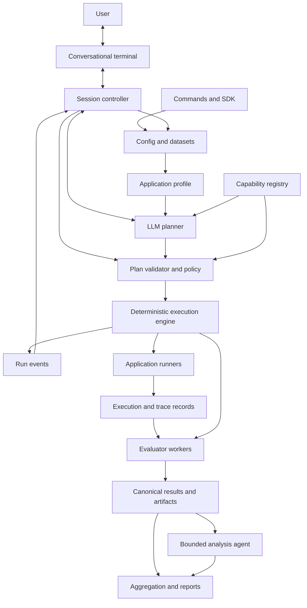

# AI Application Evaluation Harness — Implementation Plan

**Working name:** BenchCraft (`BenchCraft`; name/package availability not checked)  
**Document:** v1.1, 21 September 2026  
**Status:** Proposed architecture and implementation sequence; no product code implemented.  
**Scope:** The 25-part implementation brief in the supplied attachment, supplemented by current primary-source research and engineering recommendations.

**Amendment v1.1:** Make a persistent, two-way terminal conversation the primary product interface. Add benchmark-specific dialogue, live run controls, session persistence, and conversational result exploration to MVP; preserve scriptable commands and deterministic execution.

## 1. Product definition

Build an open-source **conversational CLI for AI application benchmarking**. The user opens `aibench` and works with a benchmark assistant through an ongoing two-way dialogue: describe the application, answer focused questions, refine evaluation choices, run tests, ask about progress, inspect failures, and decide the next experiment. The assistant translates agreed decisions into a **validated, versioned evaluation plan**, executes it through independent runners and evaluators, and produces an evidence-linked report.

The intended Hermes-like experience is an interactive terminal assistant specialized in this benchmarking problem. Conversation is the main user experience throughout the work, rather than a one-time setup wizard. Ordinary commands remain available for scripting and CI.

The LLM helps understand the application and propose measurements. It does not own scheduling, authorization, accounting, aggregation, or the authoritative run state. The harness must also work with a manually authored plan and no planning model.

The first customer is an AI engineer maintaining a RAG or tool-using application who needs to answer: “What can I actually measure here, what evidence is missing, and did this change improve the application?” This fits a software-house setting with multiple client stacks better than a general-purpose public model leaderboard.

### Competitive reality

Do not position the product as “the first eval harness” or “existing libraries cannot orchestrate evaluations.” DeepEval now explicitly describes an evaluation harness for coding agents [S2]. Promptfoo already supports configurable assertions, including Python, and evaluating stored outputs [S4]. Langfuse documents datasets, experiments, application evaluation, and CI regression checks [S6]. Ragas, Phoenix, Braintrust, and TruLens also overlap with portions of the workflow [S5, S7–S9]. The supplied DeepEval alternatives article is vendor marketing, useful for discovery but insufficient for neutral capability comparisons [S1].

The defensible product hypothesis is **evaluation-plan engineering across frameworks**:

- Requirements become explicit evaluation objectives and executable checks.
- Every check declares its evidence requirements and applicability.
- Missing observability appears as a coverage gap, never a fabricated score.
- Different evaluator implementations can run on the same recorded application execution.
- Evaluation semantics, versions, uncertainty, and provenance survive normalization.
- Teams can reproduce decisions and distinguish application failures from evaluator failures.

This differentiation is a hypothesis to validate with users, not an established market gap. Before broad expansion, test whether three teams prefer this workflow over their existing evaluator plus a script. If not, a smaller planner/plugin for established tools may be the better product.

### Explicit first-version boundaries

The harness–user conversation is multi-turn from MVP. Separately, support evaluation of single-turn text applications and recorded tool activity first. Design extension points for conversations, coding environments, audio, and multimodal inputs, but do not claim support until their execution and evidence contracts exist. A general schema is cheap; trustworthy general evaluation is not.

## 2. Core concepts

| Concept | Meaning and invariant |
|---|---|
| Dataset | Immutable collection of cases, a schema version, provenance, and a content digest. |
| Golden / BenchmarkCase | Facts, input, references, expectations, and fixtures known before execution. Runtime data never gets written into it. |
| ApplicationSpec | How to invoke the system under test, what input it receives, its version, and its declared effects. |
| ApplicationProfile | Evidence-backed observations about interfaces, architecture, instrumentation, and uncertainty. |
| EvaluationObjective | User requirement, such as refund-answer correctness or preventing unauthorized bookings. |
| EvaluationPlan | Frozen evaluator selections, bindings, sampling, thresholds, budgets, and aggregation rules. |
| ExecutionResult | What occurred during one case repetition and attempt, including partial results and missing observations. |
| EvaluationView | Read-only join of a Golden and an ExecutionResult; constructed only for authorized evaluators. |
| EvaluationResult | One measurement with typed value, provenance, evidence, and execution status. |
| BenchmarkSpec | Dataset + application + evaluation plan + execution configuration. |
| Run | A concrete invocation of a BenchmarkSpec with recorded identities and artifacts. |
| Experiment | Comparable runs with an explicit intended change and documented uncontrolled differences. |
| BenchmarkSession | Persistent user–assistant conversation linked to a project, objectives, draft plan revisions, runs, and decisions. A session may contain several runs. |
| ConversationTurn | User message or assistant response with artifact references and typed actions; never an executable plan by itself. |
| DecisionRecord | Structured interpretation of a user choice, linked to the original turn and the exact affected plan revision. |

Separate **application inputs** from **judge-only references**. Sending the entire Golden to an application can leak expected answers. A case may contain a document fixture intentionally available to the app, but this must be an explicit input binding; a reference answer is not automatically an app input.

Treat model calls in three distinct roles: application model, planning model, and judging model. Each has separate credentials, budgets, usage records, and provenance.

## 3. User workflow

### Primary workflow: open the benchmark assistant

```bash
aibench
aibench chat --project ./my-app
aibench chat --resume SESSION_ID
```

`aibench` with an interactive terminal opens a conversation. It loads the selected project's declared configuration and asks what the user wants to evaluate. It does not require the user to know evaluator names or manually write YAML. With multiple sessions, show a chooser rather than silently resuming the wrong project.

The assistant can initiate a useful question: “Does your endpoint expose the retrieved passages?” The user can challenge its proposal: “Why faithfulness rather than correctness?” The assistant explains the difference using available evidence and can revise the draft. It asks only questions whose answers materially change the benchmark, normally one or two at a time. Known configuration and earlier answers are reused.

The conversational workflow remains open after execution: users can request specific failures, question a score, change a proposed next-run setting, and rescore existing outputs. Every completed response states whether it explained something, changed a draft, or actually executed an action.

### Representative conversation

All counts and budgets here are illustrative, not actual execution results.

> **User:** Evaluate my support RAG app in `./support-app`. I have `./benchmark/dataset.jsonl`.
>
> **Assistant:** I can read the selected project's evaluation config. It declares an HTTP endpoint and 100 dataset cases. Are you mainly checking wrong answers, unsupported claims, or both?
>
> **User:** Both. Keep this run under $5.
>
> **Assistant:** The response mapping includes the retrieved passages, so faithfulness is measurable. Your reviewed references also support a correctness check. I drafted both plus latency and errors. Here are the exact endpoint, judge, sample, and spend limits. The $5 limit is soft where provider billing cannot be strictly bounded; call and token limits are enforced. Run this plan?
>
> **User:** Use 20 cases first.
>
> **Assistant:** Updated the draft to a seeded 20-case pilot. The full dataset is unchanged. Estimated usage and coverage are shown in the plan summary.
>
> **User:** Run it.
>
> **Assistant:** Started the reviewed pilot as run R1. You can ask questions while it runs.
>
> **User:** What does faithfulness measure?
>
> **Assistant:** Whether the answer is supported by the passages actually retrieved. An answer can be faithful to an incorrect source, so this does not replace correctness. R1 continues running.
>
> **User:** Show the failures and explain the lowest score.
>
> **Assistant:** Here are the completed failures, their case IDs, judge explanations, and supporting passages. This is a partial snapshot until R1 finishes.
>
> **User:** Evaluate those same answers with another evaluator.
>
> **Assistant:** I will check installed compatible evaluators and draft a rescore using R1's saved outputs. If none is installed, I will explain the available integration options.

The assistant does not claim to have inspected arbitrary source code in MVP: it reads declared configuration and dataset metadata. More capable repository inspection arrives in Phase 2.

### Scriptable workflow

```bash
aibench init
aibench inspect ./my-app
aibench plan --dataset ./benchmark/dataset.jsonl
aibench plan validate ./benchmark/plan.json
aibench run ./benchmark/
aibench report RUN_ID --format html
```

1. `init` creates a minimal configuration and examples; it does not install arbitrary packages or execute the application.
2. `inspect` reads approved files and manifests, building a profile with evidence and unresolved assumptions. Dynamic probing is separate and policy-controlled.
3. `plan` combines objectives, dataset field coverage, available observations, and installed evaluator manifests. It writes a draft plus validation findings.
4. The user reviews coverage, estimated spend, endpoints, execution privileges, and unavailable checks. Approval binds the executable plan and policy hashes.
5. `run` validates again, freezes the run manifest, invokes the app, records outputs, scores eligible cases, and writes deterministic summaries.
6. `report` renders results without rerunning applications or judges. Optional LLM analysis uses aggregates and selected redacted examples.

### One-command workflow

```bash
aibench benchmark ./my-app --dataset ./benchmark/dataset.jsonl
```

In an interactive terminal this opens the same conversational session with app and dataset already selected, then composes inspection, planning, validation, review, execution, and follow-up discussion. In `--non-interactive` mode it uses the headless workflow without questions. It cannot reliably infer an unknown invocation protocol or business acceptance criteria. If those are absent, it produces an actionable draft identifying the missing fields. It must not invent an HTTP endpoint, output schema, or success threshold.

```bash
aibench benchmark ./my-app --dataset ./benchmark/dataset.jsonl \
  --auto --policy ./benchmark/policy.yaml
```

`--auto` runs only within an existing policy. It does not authorize new destinations, package installation, app modifications, or destructive actions. Persist approvals so routine reruns inside the same approved scope do not ask again. In noninteractive mode, unresolved policy requirements cause a machine-readable blocked result.

## 4. System architecture



Implement one Python package with clear module boundaries before creating services. The planner is a replaceable client of the core contracts. The engine accepts only a validated plan; it never executes a planner's free-form prose.

| Module | Owns | Must not own |
|---|---|---|
| Conversational terminal | Editable input, history, streamed replies, tool cards, progress, slash commands | Direct worker orchestration |
| Session controller | Turns, decisions, pending questions, run subscriptions, typed action dispatch | Changing frozen plans or inventing engine state |
| CLI/config | Headless command parsing and config resolution | Evaluation semantics |
| Dataset engine | Streaming ingestion, schema checks, provenance | Application execution |
| Inspector | Static evidence, declared capabilities, optional probe results | Unverified architectural certainty |
| Planner | Objective mapping, proposed metrics, gap explanation | Direct shell/network privileges |
| Validator/policy | Applicability, type checks, budgets, permissions, DAG validity | LLM-dependent approval decisions |
| Engine | Work states, dependencies, concurrency, cancellation, durable commits | Framework-specific metrics |
| Runner | Application lifecycle and protocol | Judge-only Golden fields |
| Observation layer | Correlation, event conversion, trace completeness | Inferring invisible tool calls |
| Evaluator adapter | Framework translation and metric execution | Re-executing the app by default |
| Storage/artifacts | Durable facts, indexes, immutable payloads | Rewriting historical runs |
| Reporting | Aggregates, comparisons, evidence navigation | Inventing causal diagnoses |

Both the conversational terminal and scriptable commands call the same application service layer. The session controller communicates with the engine through typed commands and events; it does not scrape terminal logs to infer progress. Input remains responsive while workers execute.

Enforce dependencies in tests: core models cannot import DeepEval, Hermes, OpenAI Evals, or UI packages. Adapters import the core, never the reverse.

## 5. Internal data models

Use Pydantic models with exported JSON Schema. These are proposed contracts, not literal upstream APIs.

| Model | Important fields |
|---|---|
| DatasetManifest | `schema_version`, `dataset_id`, `content_hash`, `case_count`, `source_refs`, `split`, `created_at` |
| BenchmarkCase | `case_id`, `input`, optional `reference`, `expectations`, `fixtures`, `group_id`, `metadata`, `extensions`, `provenance` |
| ApplicationSpec | `runner`, `target`, `input_binding`, `output_binding`, `revision`, `environment_digest`, `reset_policy`, `effects` |
| ObservationClaim | `capability`, `state`, `evidence_refs`, `method`, `scope`, `limitations` |
| EvaluationPlan | `plan_id`, `objectives`, `metric_specs`, `bindings`, `selectors`, `sampling`, `aggregations`, `gates`, `budgets`, `policy_hash` |
| ExecutionResult | `run_id`, `case_id`, `repetition_id`, `attempt_id`, `status`, `output`, `retrieved_context`, `tool_events`, `trace_refs`, `timing`, `usage`, `cost`, `error`, `observation_completeness` |
| EvaluationResult | Identity, typed value, status, decision, uncertainty, evidence, evaluator provenance, raw artifact reference |
| RunManifest | Dataset/app/plan/plugin hashes, model identifiers, dependency lock, parameters, seeds, environment, timestamps |
| WorkItem | Stable task key, dependency keys, state, attempt, lease information where needed |
| ArtifactRef | Digest, relative URI, MIME type, size, redaction classification, ownership/run reference |
| BenchmarkSession | `session_id`, `project_id`, `active_run_id`, `draft_plan_id`, `revision`, `created_at`, `updated_at`, `summary_ref` |
| ConversationTurn | `turn_id`, `session_id`, `role`, `content`, `artifact_refs`, `action_refs`, timestamps |
| PendingQuestion | `question_id`, `required_fields`, `choices`, `blocking_scope`, `draft_revision`, `status` |
| DecisionRecord | `decision_id`, `source_turn_id`, `structured_change`, `plan_revision`, `supersedes`, validation result |
| ActionRequest | `action_id`, `session_id`, `run_id`, `expected_revision`, typed payload, authorization scope, state |
| RunEvent | `run_id`, monotonic `sequence`, event type, committed counts, timestamps, payload reference |

Observation states should distinguish `observed`, `declared`, `inferred`, and `unknown`. A source import suggests a library is present; it does not prove that every request retrieves documents or calls tools. Represent missing, empty, and truncated observations separately.

Freeze public identity models after ingestion. Use explicit migrations between schema versions; never silently reinterpret historical results. Preserve original input bytes in a restricted artifact when appropriate, alongside the normalized case and transformation history.

## 6. Dataset schema

JSONL is the native interchange format. Each nonblank line is an independent object. A friendly shorthand accepts the examples from the brief and normalizes them into a stricter internal schema.

```jsonl
{"case_id":"chat-001","input":"What is your refund policy?"}
{"case_id":"rag-001","input":"What is your refund policy?","expected_output":"Refunds are available within 30 days.","context":["Refunds may be requested within 30 days of purchase."],"metadata":{"category":"refund"}}
{"case_id":"agent-001","input":"Book me a flight to Dubai.","expected_tools":["search_flights","book_flight"],"metadata":{"category":"booking"}}
{"case_id":"code-001","input":"Find and fix the authentication bug.","repository":"./repos/auth-service","metadata":{"bug_id":"AUTH-017"}}
```

### Normalization rules

- `expected_output` becomes `reference.answer`.
- Legacy `context` becomes `reference.context`, with a warning explaining that it is **not observed retrieval**. Users explicitly mark app-visible context fixtures when intended.
- `expected_tools` becomes a tool-name expectation with matching mode `contains_all`, allowing extras and imposing no order. This compatibility behavior is printed during validation; users choose `exact`, `ordered_subsequence`, or a richer contract when required.
- `repository` becomes a repository fixture reference. A coding run additionally needs an immutable commit, execution environment, setup recipe, hidden tests, and success criteria; the example alone is insufficient.
- Missing case IDs are generated from normalized content plus a duplicate occurrence index; explicit IDs are strongly recommended for longitudinal comparisons. Report duplicates rather than silently deleting them.
- Unknown top-level keys produce a validation error with migration advice. Custom fields belong in namespaced `extensions`; flexible data should not make misspellings invisible.
- Paths resolve relative to the dataset/config root and must satisfy filesystem policy. An absolute path alone is not portable identity.

Stream parsing with maximum line/payload sizes, precise line-number errors, duplicate-ID detection, and content hashes. Validate the full dataset before expensive execution; use an on-disk index for very large files.

### Better agent expectations

Tool-name matching is only a proxy. Add constraints for argument schemas, allowed destinations, ordering where required, forbidden calls, final world-state predicates, and required user authorization. A flight-booking case with no dates or confirmation may correctly ask a clarifying question. The planner should flag that ambiguity instead of enforcing `book_flight` because the reference listed it.

### LLM-generated data and circular evaluation

Question generation → answer generation → model judging can reinforce the same mistaken assumptions. Using different models reduces some correlation but does not establish truth.

Require `origin`, source document/version, source spans, generator identity, prompt hash, review status, and reviewer identity when reviewed. Separate `synthetic_unverified`, `source_verified`, `human_reviewed`, and `executable_oracle` reference statuses. These are provenance labels, not guarantees of correctness.

Generated cases start in a candidate pool. Promote them only after source verification, expert review, or executable checking. Report results by reference status. Keep generation/development data separate from sealed test cases; deduplicate by source and semantic similarity where feasible. The planner receives schema summaries and sanitized development examples, not unrestricted hidden labels. Fresh tests are needed after repeated optimization against a holdout.

## 7. Application interface

Define the conceptual runner lifecycle as `describe`, `prepare`, `healthcheck`, `invoke`, `reset`, and `close`. Invocation accepts an app-visible input envelope plus execution context and emits typed events followed by a result. Each operation is cancellable and time-bounded.

| Interface | Integration burden | What can be observed | Phase |
|---|---|---|---|
| CLI one-shot | Existing command plus input/output mapping or thin wrapper | Output, stderr, exit status, wall time | MVP |
| HTTP request/response | URL, auth reference, request/response bindings | Output, HTTP errors, end-to-end time; traces only if exposed | MVP |
| Python callable | Small async/sync adapter | Structured outputs and explicitly returned observations | Phase 2 |
| Container | Image digest, command, mounts, limits, lifecycle | Same protocol plus stronger environment control | Phase 2 |
| SDK instrumentation | Small integration in application | Rich component spans, usage, retrieval, tools | Phase 2 |
| OpenAI-compatible endpoint | Base URL and protocol settings | Model response/usage as provided; not hidden app internals | Phase 2 |
| Tool-using application | One of the above plus events and test-world fixtures | Tool attempts, outcomes, world state if supplied | Basic records MVP; rich contracts Phase 2 |

An OpenAI-compatible endpoint is an application transport. It is unrelated to whether the OpenAI Evals evaluator plugin is installed.

### CLI protocol

Default to an argv array with `shell=false`, JSON input on stdin, JSON result on stdout, and diagnostics on stderr. Support an explicit plain-text output mode for legacy apps. Never interpolate case text into a shell command. Limit output size, terminate the process group on timeout, and retain bounded logs. Use one process per case initially; a persistent JSONL worker protocol comes later and must correlate request IDs.

### HTTP protocol

Use JSON Pointer-style mappings instead of arbitrary template execution. Support secret references for headers, TLS verification, allowed endpoints, bounded response sizes, explicit timeouts, and correlation headers. A timeout does not prove a server-side operation did not occur.

### State and observability

Record whether sessions are isolated, resettable, or shared. Multi-turn episodes preserve state within the episode and reset between episodes. External indexes, databases, system time, tool fixtures, and feature flags belong in the reproducibility manifest where controllable.

For black-box apps, output and wall time may be the only honest observations. Tool calls, token usage, retrieval results, and cost remain unknown unless exposed by responses, instrumentation, or a trusted accounting source. Offer an observability-gap report and a minimal integration recipe instead of demanding a full rewrite.

## 8. Agent architecture

Use an ongoing conversational session containing bounded agent turns. Each turn interprets a user request, reads relevant structured state, answers or calls permitted tools, and returns control to the user. Planning remains a bounded subroutine: inspect evidence → clarify material gaps → propose plan → validate → repair a limited number of times → emit draft. Post-run analysis is a separate read-only operation within the same user-visible conversation.

### Dialogue and action protocol

A turn can produce `answer`, `ask_question`, `propose_plan_patch`, `request_action`, or `explain_results`. These are typed outputs validated outside the LLM. The session stores both the original user message and its interpreted changes. Natural language never becomes a shell command.

Tools include `ask_user`, `get_session_state`, `propose_plan_patch`, `get_run_status`, `list_failures`, `get_case_evidence`, `start_run`, `pause_run`, `resume_run`, `cancel_run`, and `rescore_run`, alongside the planning tools below. Tools are state- and policy-scoped. During analysis, the agent gets read-only tools; a user request to take action is routed through the validated action path.

“Why this metric?” is an explanation request. “Only use 20 cases” changes a draft. “Run it” may authorize the specific displayed plan when it is unambiguous and within policy. “Looks interesting” is not execution authorization. An explicit user instruction that already specifies the action and scope need not trigger another confirmation; ask only for material missing scope or a genuinely new permission.

Pending questions carry the draft revision. If the user changes the dataset while a question is outstanding, invalidate stale choices. Applying a plan patch uses an expected revision so delayed model responses cannot overwrite newer user decisions. Deduplicate action IDs so retries of a turn cannot start duplicate runs.

User follow-ups during execution can ask for status or explanation without interrupting the run. A request that would change the dataset, evaluator, judge, thresholds, or sampling creates a new draft/run revision. Offer to finish or pause the active run; never rewrite its frozen plan. Operational pause/resume/cancel actions are recorded events rather than benchmark-definition changes.

Bound reasoning/tool calls per turn and summarize long sessions using durable decision and artifact references. Reload actual project/run state after resumption; a compressed conversation summary is not authoritative. Optional project preferences are explicit, editable defaults, never hidden modifications to historical benchmarks.

| Task | LLM role | Deterministic responsibility |
|---|---|---|
| Architecture understanding | Interpret evidence and ambiguity | Gather files, parse manifests, retain evidence locations |
| Objective discovery | Propose questions and missing requirements | Preserve declared user requirements |
| Metric choice | Rank eligible options and explain tradeoffs | Compute eligibility and resolve installed IDs |
| Plan generation | Produce schema-constrained draft | Validate bindings, budgets, thresholds, policies, DAG |
| Execution | None per ordinary case | Schedule, invoke, retry, persist, cancel |
| Judging | Only selected judgment metrics | Input isolation, schema validation, usage capture |
| Reporting | Summarize failures and suggest hypotheses | Compute every number and evidence denominator |

Expose narrow planner tools: `read_profile`, `list_evaluators`, `describe_evaluator`, `summarize_dataset`, `validate_plan`, `estimate_cost`, and `write_plan_draft`. Do not expose a general terminal. Dynamic probes are engine requests subject to existing policy, not free-form code execution.

### Preventing invented capabilities

The registry supplies exact versioned metric IDs, required fields, applicability predicates, output types, and restrictions. The planner can only choose from that list. Resolve and validate all IDs outside the model. Reject missing credentials, incompatible versions, cyclic dependencies, undefined selectors, unavailable bindings, and unsupported aggregation operations.

A capability such as `tool_selection` is eligible only for cases with adequate tool observations and an appropriate expectation. A RAG label alone does not make faithfulness computable. Planning uses declared availability; execution checks actual per-case availability again.

Freeze plan hashes before scoring. If a pilot exposes missing fields, create a new plan revision and record the pilot separately. Never silently change thresholds after seeing failing results. A maximum repair count and planner spend limit prevent endless self-correction; fall back to a deterministic template with unresolved gaps.

### What to learn from Hermes

Hermes documents separate agent-loop, provider-resolution, tool-dispatch, session-storage, plugin, and execution-backend components [S10–S11]. Reuse these separation principles and its terminal interaction ideas. Study the architecture page's pointers to `model_tools.py`, `tools/registry.py`, `hermes_cli/runtime_provider.py`, and execution backends before any selective code reuse. This research reviewed the architecture documentation and README, not a complete source audit.

Do not fork the entire assistant. Messaging gateways, personal memory, and broad terminal access create maintenance and permission surfaces this harness does not need. Create a small runtime around typed planning tools. Later, expose the harness to Hermes through a CLI skill or MCP wrapper. If copying code, pin the source commit, check file-level licensing and dependencies, and retain required notices.

Saved evaluation recipes must be explicitly versioned. Agent “learning” must never silently change a benchmark's rubric between runs.

## 9. Evaluator/plugin architecture

Use distinct plugin kinds: **evaluator**, **runner**, **trace importer**, **dataset connector**, and **report exporter**. A platform is not necessarily a callable metric library.

| Integration | Recommended role | Initial priority |
|---|---|---|
| Native/custom evaluators | Exact match, JSON schema, tool contracts, domain oracles | MVP |
| DeepEval | Selected judge metrics through an isolated adapter | MVP |
| Ragas | Alternative RAG/agent metric implementations | Phase 2 |
| OpenAI Evals OSS | Compatible registry benchmarks through completion-function integration | Phase 2 |
| OpenAI Evals API | Hosted evaluation jobs; separate remote adapter | Phase 2, demand-led |
| Promptfoo | Stored-output assertion batches or explicitly delegated suites | Phase 2 |
| Phoenix | Evaluation functions and trace/experiment integration as separate plugins | Phase 2, demand-led |
| Langfuse | Trace/dataset import and experiment/result export | Phase 2, demand-led |
| Braintrust | Scorer integration and experiment/result exchange | Phase 2, demand-led |
| TruLens | Feedback and instrumented-trace integration | Later, demand-led |

This covers the five alternatives named in the supplied comparison, plus the requested OpenAI integrations and a few relevant additions. It is not an exhaustive list of every evaluator in existence. Official capabilities were checked through [S3–S9, S12–S14].

### Plugin manifest

Require plugin ID/version, supported core schema range, package/environment digest, metric ID and semantic version, input requirements, modality, scope, output schema, score direction, reference requirements, observation requirements, model/credential needs, network destinations, batching support, internal retry/concurrency behavior, and estimated resource use. Include a semantic description and known limitations.

Discover installed plugins using Python entry points, but read manifests without importing untrusted code into the CLI process. Run third-party discovery/loading inside a controlled worker. An installed package is executable code, not harmless metadata.

### Adapter contract

Conceptual methods: `describe()`, `validate_binding(plan_fragment)`, `prepare(config)`, `evaluate(view, context)`, optional `evaluate_batch(views, context)`, and `close()`. The context supplies cancellation, artifact writing, rate/budget reservations, secret handles, and usage reporting. Adapters return canonical results plus references to raw payloads.

Separate synchronous local metrics from remote jobs. Remote adapters additionally implement `submit`, `poll`, `fetch_results`, and best-effort `cancel`, persisting external IDs before polling.

Adapters declare whether they consume existing outputs or own application execution. The default is scoring recorded outputs. Delegated suites must expose their execution boundary and provenance; never accidentally run the app twice to score it.

MCP can expose planning, running, and result-query operations to other agents. It is a transport and discovery surface, not the canonical schema or the million-case worker protocol. Registry validation and policy enforcement remain mandatory behind MCP.

## 10. DeepEval adapter design

Start with `deepeval.faithfulness` and one native custom metric. DeepEval documents faithfulness as comparing actual output against retrieval context and requires input, actual output, and retrieval context [S3]. Keep upstream translation inside this plugin.

| Harness field | DeepEval binding |
|---|---|
| `case.input` | `LLMTestCase.input` |
| `execution.output.text` | `LLMTestCase.actual_output` |
| `execution.retrieved_context[].text` | `LLMTestCase.retrieval_context` |
| `case.reference.answer` | `expected_output` only for metrics that require it |

Never substitute Golden reference context for missing runtime retrieval. Missing retrieval produces `not_applicable` with a missing-evidence reason. Observed empty retrieval is distinct: under the first adapter policy, faithfulness is `not_applicable: empty_context`, while a separate retrieval-availability check records the empty result. This prevents accidental perfect scores and makes coverage loss visible. Rubrics for unanswerable questions may define another explicit policy.

Use standalone metric execution under the harness scheduler; do not inherit a second full benchmark runtime. Create independent metric instances per task or documented worker scope; mutable metric objects must not be shared unsafely.

Pin the dependency, explicitly configure judge and settings, preserve score/reason/raw artifacts, and capture actual judge usage when possible. Unknown usage remains unknown. Wrap blocking calls in worker processes so cancellation is enforceable. Bound nested concurrency and retries, and disable optional external publishing unless configured.

Keep framework-native success information as metadata, but use the frozen harness threshold for the canonical decision. Contract fixtures test mapping, empty/missing context, errors, unsupported output formats, state isolation, and version drift. No claim of numeric equivalence with Ragas faithfulness is implied.

## 11. OpenAI Evals adapter design

“OpenAI Evals” refers to two different integration targets. Use separate plugins rather than a configuration flag that hides this distinction.

### A. `openai_evals_oss`

The open-source repository contains an evaluation framework/registry and a completion-function interface [S12–S13]. Run it in a pinned worker environment. Initially support an explicit allowlist of compatible eval types.

For live mode, a completion-function bridge calls the harness runner. The adapter owns a delegated execution stage and imports its records. For recorded-output mode, use replay only when the eval's requested inputs match recorded requests exactly and a stable case mapping exists. A benchmark that dynamically asks follow-up questions cannot be honestly satisfied by one precomputed answer.

Parse supported event/output formats into canonical results; keep all relevant raw logs. Unsupported custom evals return a clear compatibility error. Do not promise every repository benchmark accepts arbitrary agent traces.

### B. `openai_evals_api`

The hosted API defines eval criteria/data schemas and separate runs [S14]. Treat it as an asynchronous external service with explicit data-egress permission, provider credentials, remote job identifiers, upload provenance, and cost accounting.

For scoring recorded application outputs, bind supplied output fields through the supported custom-data/grader configuration and verify this against the pinned API contract. Reject unsupported mappings rather than invoking a model to generate a replacement answer. Keep model-generation experiments as a separate mode.

Persist submission state and request fingerprints before sending. On ambiguous submission failure, reconcile remote state where supported; do not assume an undocumented idempotency guarantee. Fetch paginated results, preserve external case IDs, verify one-to-one mapping, and record partial completion and cancellation limits.

Ship the OSS adapter first only if target users need its benchmarks; otherwise a Ragas or Promptfoo adapter may deliver more value. Neither OpenAI integration belongs in the critical path of the first release.

## 12. Unified result schema

Normalize the **record structure**, not the meaning of unrelated scores.

| Group | Fields/semantics |
|---|---|
| Identity | Schema version, result ID, run ID, scope, case/episode/component/slice IDs, repetition, evaluation attempt |
| Metric identity | Namespaced metric ID, semantic version, implementation/plugin version |
| Value | Tagged union: scalar, boolean, category, vector, distribution, or structured record |
| Measurement semantics | Unit, direction (`higher`, `lower`, `target`, `none`), bounds where meaningful, aggregation contract |
| Execution status | `ok`, `error`, `not_applicable`, `skipped`, `cancelled` |
| Decision | `pass`, `fail`, `indeterminate`, `not_evaluated`; independent of execution status |
| Rule | Threshold/comparator or categorical predicate, rule ID/version |
| Evidence | References to case fields, outputs, spans, tool events, or external state checks |
| Provenance | Judge identity/settings, prompt/rubric hashes, adapter version, input digest |
| Uncertainty | Method, interval/replicates, sample size, assumptions; optional |
| Resources | Evaluator latency, token usage, evaluator cost, accounting completeness |
| Raw result | Immutable artifact reference, format, digest, redaction status |

Example: a faithfulness judge succeeds with value `0.64`, status `ok`, and decision `fail` against threshold `0.80`. A network timeout has status `error`, no score, and decision `not_evaluated`. It is not a zero-quality answer. An unknown metric cost is null with a reason, not USD 0.

Use metric scope `case`, `episode`, `component`, `slice`, or `run`. Traces are referenced evidence, not forced into scalar metrics. Keep distributions or confusion matrices as structured results with explicit schemas.

Do not present an LLM's self-reported certainty as calibrated confidence. Repeated judge agreement estimates stability, not factual validity. Keep application randomness, judge randomness, and dataset-sampling uncertainty separate.

### Aggregation and comparison

Every metric summary includes total selected, eligible, attempted, completed, error, skipped, and unavailable counts. Report eligible coverage and successful-evaluation coverage against all selected cases. Predeclare completeness gates so losing observations cannot improve a release decision.

Compute means only for metrics whose semantics permit them. Use case-level macro averages by default; label claim-weighted or token-weighted alternatives. For latency show p50/p95 and failure/timeout counts. Separate successful-request latency from censored timeouts and throughput; define concurrency and load conditions.

For comparisons, pair by case ID/content version and repetition policy. Show differences and uncertainty using a method appropriate to the data, such as paired bootstrap at the independent case or customer/session group level. Report judge repeats separately. Do not treat dependent turns as independent samples. Correctness of a confidence interval depends on sampling assumptions; it does not validate a biased dataset.

Refuse an unqualified regression claim when dataset, judge, rubric, metric semantics, or instrumentation changed. Offer an explicitly noncomparable exploratory view or rescore both recorded-output sets with the same evaluator version. Cross-framework disagreements are diagnostics, not votes to average indiscriminately.

Reports provide a metric profile, predeclared release gates, and quality/cost/latency tradeoffs. An aggregate task-success rate is defensible when cases share an explicit success contract. An arbitrary overall “AI quality” score is not.

## 13. CLI design

### Interactive terminal contract

The default terminal displays the selected project/session, conversation, compact tool/result cards, and an input prompt that remains usable during execution. A status area shows the active run, completed/selected counts, failures, spend completeness, and running/pausing/paused state. Metric details and raw logs open on request; do not flood the conversation with one message per case.

MVP needs a reliable REPL with multiline input, history, basic completion, streaming, and asynchronous progress. A full-screen layout is optional polish. In a non-TTY, bare `aibench` prints command guidance rather than starting an unusable chat. Headless commands never prompt when `--non-interactive` is set.

| Interactive input | Behavior |
|---|---|
| Natural-language message | Discuss objectives, refine drafts, request actions, or explore results |
| `/help` | Explain benchmark tasks and commands |
| `/plan` | Show draft, differences, missing inputs, coverage, and cost estimate |
| `/run` | Start the validated current draft within existing authorization |
| `/status` | Read committed engine state without requiring an LLM |
| `/pause` / `/resume` | Stop new dispatch and later continue the selected run |
| `/stop` | Cancel the selected run through deterministic control |
| `/failures` / `/case CASE_ID` | Query results and case evidence |
| `/budget` | Show ceilings, reservations, spend, and unknown accounting |
| `/report` | Render the selected run's current or final report |
| `/sessions` / `/new` | List sessions or start a fresh conversation in the project |
| `/exit` | Exit; if a run is active, state the pause/exit behavior |

Slash commands bypass natural-language intent inference. Pause/stop/status must work even if the model provider is unavailable. `Ctrl+C` clears idle draft input; during response generation it interrupts that response without silently cancelling a benchmark. If a run is active, display explicit pause/stop options. The `/stop` command is the unambiguous run-cancellation control.

No daemon is required in MVP. Exiting with an active run safely pauses new dispatch and records in-flight outcomes before closing; abrupt process loss uses the engine's recovery rules. Reopening a chat restores context but never restarts execution automatically. Later detached workers may support continuing after terminal exit, with explicit UX and supervision.

### Scriptable commands

| Command | Responsibility |
|---|---|
| bare `aibench` / `chat --project PATH` | Open the primary conversational experience |
| `chat --resume SESSION_ID` | Restore discussion, decisions, and current run state |
| `sessions list` | List persistent conversations |
| `init` | Create configuration and sample benchmark |
| `doctor` | Check environments, plugins, credentials availability, and runner prerequisites |
| `dataset validate PATH` | Validate, fingerprint, and summarize cases |
| `inspect APP` | Build evidence-backed application profile |
| `plan` / `plan validate FILE` | Propose or validate a plan |
| `run [DATASET_OR_DIRECTORY]` | Execute an existing plan; current config if omitted |
| `benchmark APP` | Guided inspect → plan → run composition |
| `evaluate RUN_ID --plan FILE` | Rescore stored executions without rerunning the app |
| `resume RUN_ID` | Continue eligible incomplete work under original identities |
| `runs list` / `runs show ID` | Inspect status and provenance |
| `compare BASELINE CURRENT` | Compare compatible runs |
| `report RUN_ID` | Render JSON, Markdown, or HTML |
| `evaluators list` / `evaluators describe ID` | Inspect installed capabilities |
| `plugins list` | Inspect all installed plugin kinds |

`aibench run dataset.jsonl` uses the application and plan from the resolved config. `aibench run ./benchmark/` resolves `config.yaml`, `dataset.jsonl`, and the referenced plan from that directory. Passing only a dataset is not enough to identify an application.

Global options include `--config`, `--json`, `--non-interactive`, and an explicit policy path. Document precedence as defaults < config < permitted environment overrides < CLI flags; record the resolved configuration with secrets redacted. Dataset content cannot override security policy.

Proposed exit codes: 0 complete with gates satisfied; 1 complete with gate failures; 2 invalid input/plan; 3 infrastructure or incomplete evaluation; 4 authorization required; 130 interrupted. If both quality failure and infrastructure incompleteness occur, use 3 and record both in JSON. Distinguish stdout machine output from stderr progress.

## 14. Storage architecture

Start local: SQLite for indexed state and metadata; immutable files for large artifacts and portable exports. Use WAL on a supported local filesystem, one writer queue, transactions, foreign keys, and explicit schema migrations.

Tables: `sessions`, `conversation_turns`, `decision_records`, `pending_questions`, `action_requests`, `run_events`, `datasets`, `cases`, `applications`, `profiles`, `plans`, `runs`, `work_items`, `execution_attempts`, `evaluation_attempts`, `metric_results`, `artifacts`, `usage_events`, and `approvals`. Keep summarized searchable columns in SQL and large outputs/traces outside it. Use unique task/result keys to prevent duplicate logical commits.

Store under a configurable `.aibench/` workspace: metadata DB, run manifests, content-addressed artifacts, sanitized exports, and dependency locks. Hashes identify content, not access permission. Use project isolation; sensitive payload hashes should not become public discovery indexes.

Artifact commits: write temporary bytes, flush and atomically rename on the same filesystem, then commit the reference transaction. A crash can leave an orphan artifact, which garbage collection can remove after a grace period. A result must never reference a half-written artifact.

### Session persistence

Persist conversation turns, structured decisions, active artifact references, and tool action outcomes. Store emitted run events with sequence numbers so the terminal can reconnect and replay missed updates without executing commands twice. Session export/redaction and deletion are separate from immutable benchmark records; deleting a conversation does not silently delete its run results.

Do not store provider keys in chat history. Session summaries retain objectives, confirmed constraints, unresolved questions, and references to plan/run IDs. Credentials are configured through secret references rather than pasted into the assistant. If the chat provider fails, completed results, slash controls, and headless commands remain available.

### Cache boundaries

Execution caching is opt-in. Its key includes input, app/config/version, environment and fixtures, session policy, and sampling settings. Disable it for effectful apps or externally changing state unless explicitly snapshotted. A cached output is not a fresh latency measurement.

Evaluation caching keys include execution content, every bound reference, metric/plugin versions, judge identity/settings, rubric/template hash, and relevant policies. Judge caching reuses a previous observation; it is not an independent repetition. Always label cache hits. Mutable model aliases weaken reproducibility even when their strings match.

Persisted completed tasks are resume state, not an optional performance cache. MVP needs durable resume identity before introducing cross-run cache reuse.

At scale, move coordination metadata to PostgreSQL and large artifacts to object storage; export analytic tables to partitioned Parquet for efficient scans. Do not put SQLite on shared network storage or assume millions of large trace blobs belong in one SQL table.

## 15. Execution/concurrency model

Compile a plan into a dependency graph of work: application invocation → recorded execution → eligible metrics → aggregates. Schedule bounded batches; do not materialize a million tasks as Python coroutines.

Local execution starts with one application worker and bounded evaluator workers. Async I/O handles HTTP and supported evaluator calls; processes isolate blocking Python/native work and enforce hard timeouts. One writer persists all results. Implement concurrency caps in MVP, even if the default is 1; richer parallelism is Phase 2.

### Live conversation and engine control

Run the terminal input loop, model streaming, and execution scheduler as independently cancellable activities. Blocking work remains in subprocesses. Emit progress from committed engine state through a bounded/coalesced event channel; retain critical transitions durably and rate-limit display updates.

`pause` stops new work dispatch and drains in-flight work where possible. Show `pausing` until it reaches a safe boundary. A hung or noncancellable remote request may continue incurring spend; do not claim it has stopped. `resume` continues the same frozen plan. `cancel` ends scheduling, attempts worker cancellation, and preserves partial results and unknown-effect records.

Answer progress questions against a timestamped snapshot. Label partial aggregates provisional. A chat interruption cancels only the relevant assistant turn; an explicit run-control action changes engine state. MVP allows one active run per session, while retaining history of several runs.

### Work states and retry policy

Work states: pending, running, succeeded, failed, blocked, cancelled, and unknown-effect. Each retry gets a new attempt record. Retrying a transient error does not erase the first attempt or its cost. Declare the rule for selecting the final attempt; do not retry valid low scores to obtain a better answer.

Retry rate limits, transient network errors, and eligible provider failures with bounded exponential backoff, jitter, and `Retry-After` support. Do not retry validation failures or permission denials. Prevent multiplication between SDK retries, adapter retries, and engine retries.

For effectful app timeouts, use an application-supported idempotency key or reconcile state before retrying. Otherwise mark unknown-effect and require intervention. The harness cannot guarantee exactly-once external effects. It can deduplicate internal result commits.

On interruption, stop scheduling, signal workers, persist finished records, and mark interrupted in-flight work according to effect risk. Resume checks original dataset/plan/app identities before claiming remaining work.

### Budget control

Track application, planner/conversation, and evaluator spend separately. Conversation spend includes follow-up explanations and analysis, with per-turn and per-session limits shown separately from run costs. Reserve estimated worst-case resources before dispatch and reconcile actual usage. Cap tokens, calls, wall time, retries, and concurrency. If a provider cannot supply enforceable cost bounds, label the monetary cap as a soft limit and use conservative call/token limits. In-flight remote work may still incur cost after cancellation.

### One million cases

The planner receives summaries and bounded samples, never a million-case prompt. Deterministic checks may run across all cases; expensive judges use a predeclared random/stratified sample and report inclusion probabilities when weighted population estimates are made. Adaptive failure sampling is useful for diagnosis but cannot be presented as an unbiased population score.

Illustrative capacity calculation: at a sustained effective 20 cases/second, one million application invocations take about 13.9 hours before overhead. At an assumed USD 0.01 per case, they cost USD 10,000 before evaluators. These are arithmetic examples, not provider quotes. Rate limits, long tails, nested judge calls, and app load determine actual throughput.

Distributed execution adds a durable queue, PostgreSQL task leases with fencing tokens, object storage, and idempotent logical commits. Delivery remains at-least-once; workers may repeat computation after failures. Late workers cannot overwrite a newer completed attempt. Distribute only after local scheduling and resume invariants are proven.

## 16. Security/sandboxing

Treat application code, datasets, retrieved documents, tool outputs, plugin code, and repository instructions as untrusted inputs. Prompt delimiters help readability but are not an authorization boundary.

| Action | Default policy |
|---|---|
| Read selected source/config files | Allowed within approved paths; exclude secrets and large/binary files |
| Send source snippets to a remote planner | Requires allowed provider/data classification in policy |
| Execute a configured local app | Explicit trusted-local mode or configured sandbox |
| Install a plugin/package or run setup scripts | Separate authorization; pin dependencies |
| Call a judge/provider | Allowed only for approved provider, data scope, and budget |
| Generate datasets | Bounded generation job; outputs remain candidates |
| Modify source code | Separate opt-in patch workflow, outside benchmark execution |
| Book, delete, pay, email, or run destructive tests | Test double/ephemeral environment by default; explicit effect policy |

A subprocess is not a sandbox. MVP may support trusted local apps and configured HTTP endpoints only, with an explicit statement that hostile code isolation is unsupported. Phase 2 containers run non-root with read-only source mounts, restricted writable directories, resource limits, bounded network egress, and no host Docker socket. Containers still require careful host configuration; hostile multi-tenant execution may need stronger isolation later.

Scope credentials separately for application and evaluators; pass only required secrets. Do not send Golden answers to application tools. Deny app access to evaluator files and hidden-test artifacts when using isolated environments. Repo instructions cannot grant network access or alter benchmark gates.

Bind approvals to target/config/plan/environment hashes and allowed actions. Approval rules are evaluated by code. Store raw traces separately from sanitized reports; escape HTML, scrub terminal control characters, and prevent report content from executing scripts. Apply configurable retention, deletion, redaction, and external-upload rules. Optional telemetry should be opt-in.

## 17. MVP architecture

**Assumption:** One developer with Python/AI experience, approximately 25 focused hours/week, using hosted models or an existing local endpoint. Planning estimate with the conversational MVP: 250–340 engineering hours, roughly 10–14 weeks at that allocation, including integration fixes and a small pilot. This is an estimate, not a delivery guarantee; at 10 hours/week it becomes roughly 25–34 weeks.

Ship:

- JSONL shorthand plus versioned native contracts.
- CLI and HTTP runners with explicit mappings and input isolation.
- Immutable case, execution, plan, and typed result models.
- Native exact-match/JSON-schema checks and one custom evaluator example.
- DeepEval faithfulness adapter with explicit applicability handling.
- Persistent two-way benchmark chat as the default CLI, with focused clarification and plan refinement.
- Basic LLM planner using declared app capabilities and installed manifests.
- Live status, responsive input, pause/resume/stop, session recovery, and conversational failure exploration.
- Manual-plan execution without an LLM.
- SQLite persistence, bounded scheduling, timeouts, cancellation, conservative resume.
- JSON/Markdown/HTML reports with coverage, errors, costs, and evidence links.
- Fixture apps for text, instrumented RAG, and mock tool use.

Do not ship automatic source architecture discovery, arbitrary code generation, a web app, distributed workers, voice evaluation, or an evaluator marketplace in MVP. `inspect` initially validates declared interfaces and static metadata; advertise its limited scope accurately.

MVP acceptance: a fresh user opens `aibench`, explains a benchmark goal in natural language, answers a material clarification, revises the draft, and starts a run. The user asks a question during execution, pauses/resumes through slash controls, closes and restores the session without duplicate execution, and discusses a failed case with evidence. The underlying workflow runs 100 fixture cases, identifies an injected RAG failure, observes a missing-evidence warning on a black-box endpoint, resumes an interrupted safe run, and rescores stored outputs without invoking the app again. A hand-authored plan must produce the same deterministic metrics as an LLM-authored plan with identical content.

## 18. Phase 2

Sequence by user demand rather than number of integrations:

1. Add Ragas or Promptfoo, proving that the canonical model supports a genuinely independent implementation.
2. Add comparisons, paired case accounting, repeated runs, coverage gates, and judge calibration tools.
3. Add Python/container runners, session reset fixtures, structured tool events, and final-state assertions.
4. Add static architecture inspection plus optional controlled probes; preserve inferred-versus-observed distinctions.
5. Add trace import and OpenTelemetry correlation, cross-run caches, and provider-aware parallel execution.
6. Add OpenAI Evals OSS/API adapters where pilot demand justifies them.
7. Add selected Langfuse/Phoenix/Braintrust connectors for existing teams' datasets and traces.

OpenTelemetry does not automatically standardize every framework's tool/retrieval semantics. Normalize versioned attributes into the harness observation model, retain raw spans, and record whether traces were sampled or incomplete. Avoid double-counting cost when both parent and child spans contain usage.

Exit gate: two independent evaluator ecosystems, two real applications, one repeatable comparison workflow, and demonstrated time saved over direct framework configuration. Publish limitations and a supported-version matrix.

## 19. Phase 3

### Discovery and generation

Autonomous discovery means searching a curated catalog of manifests and proposing plugins. Installation, trust decisions, new egress, and execution remain policy-controlled. The agent cannot declare an unknown downloaded metric trustworthy.

Dataset generation creates reviewed candidate pools with provenance, not automatic Goldens. Add domain templates, coverage maps, annotation queues, and executable oracle integrations before scaling synthetic volume.

### Advanced applications

Conversation evaluation requires episode schemas, user-simulator provenance, state resets, and independent success checks. Coding evaluation requires pinned repos, isolated environments, hidden tests, resource limits, and verified patches. Voice evaluation needs timestamped audio, transcription references, turn boundaries, transport conditions, interruption fixtures, and separate STT/TTS/interaction metrics. WER alone does not measure conversational success.

### Experiments and scale

Optimization operates only on exposed configuration parameters and development data, with budgets, experiment lineage, and a protected holdout. Keep it an optional product module so evaluation trust does not depend on the optimizer that is trying to improve scores.

Add distributed workers after measured local bottlenecks, then a dashboard backed by the same API/contracts. A marketplace comes last, with compatibility tests, provenance, explicit permissions, license metadata, and revocation mechanisms. None of these is a prerequisite to validating the core product.

## 20. Recommended technology stack

| Technology | Recommendation and reason |
|---|---|
| Python | Primary implementation; matches evaluator ecosystem and user's existing skill set |
| Pydantic + JSON Schema | Typed boundaries, config validation, versioned interchange |
| Typer + Rich | Scriptable commands, tool cards, progress/report rendering |
| Interactive input layer | A small asynchronous terminal-input component with multiline editing and history; evaluate prompt_toolkit during implementation and test supported terminals before pinning it. Keep UI replaceable. |
| asyncio + HTTP client | Bounded network work, cancellation, connection reuse |
| Worker subprocesses | Blocking evaluators, dependency isolation, enforceable termination |
| SQLite | Local metadata/state with one writer; low operational burden |
| PostgreSQL | Later shared coordination and concurrent multi-user access |
| JSONL / Parquet | Portable case/result exchange first; columnar large-scale analytics later |
| Docker | Optional reproducible execution environments; not required for trusted-local quickstart |
| OpenTelemetry | Optional observation interchange and correlation in Phase 2 |
| Python entry points | Installed plugin discovery with versioned manifests |
| MCP | Optional external agent integration; not required for internal scheduling |
| TypeScript | Optional future UI and independent JS plugins; unnecessary in core MVP |
| Rust | Defer until profiling identifies parsing, trace processing, or scheduler overhead worth a native component |

Do not write the engine in Rust just because the target scale is large. Initial bottlenecks are likely application inference, network latency, judge calls, and quotas. Python can coordinate bounded I/O at substantial scale. Rust is justified only by measured limits or a specific distribution/security requirement.

Keep the core dependency set small, with separate evaluator extras/environments and locked integration test environments. Use a narrow planning-provider interface rather than a mandatory broad agent framework. Declare and test a concrete supported Python version matrix when implementation begins; this plan does not depend on an unverified latest library release.

## 21. Repository structure

| Path | Contents |
|---|---|
| `src/aibench/cli/` | Commands, exit codes, output formatting |
| `src/aibench/tui/` | Interactive input, streamed messages, tool cards, slash commands, progress |
| `src/aibench/sessions/` | Conversation persistence, decisions, summaries, resumption |
| `src/aibench/conversation/` | Turn orchestration, focused questions, intent/action validation |
| `src/aibench/services/` | Shared typed operations used by chat, commands, and SDK |
| `src/aibench/core/` | Models, schema versions, hashes, errors, contracts |
| `src/aibench/config/` | Resolution, validation, secret references |
| `src/aibench/datasets/` | JSONL ingestion, normalization, manifests |
| `src/aibench/inspection/` | Profiles, evidence collection, static detectors |
| `src/aibench/planning/` | Templates, bounded LLM loop, plan compiler/validator |
| `src/aibench/engine/` | Scheduling, retries, cancellation, budgets, resume |
| `src/aibench/runners/` | CLI and HTTP implementations |
| `src/aibench/observations/` | Events, span normalization, completeness |
| `src/aibench/registry/` | Manifests, plugin discovery, capability matching |
| `src/aibench/evaluators/` | Native checks and evaluator contracts |
| `src/aibench/storage/` | SQLite repositories, migrations, artifacts |
| `src/aibench/reporting/` | Aggregation, rendering, comparisons |
| `src/aibench/security/` | Policy, redaction, approval identity |
| `plugins/deepeval/` | Independently packaged adapter |
| `plugins/openai_evals_oss/` | Later OSS bridge |
| `plugins/openai_evals_api/` | Later remote-job bridge |
| `schemas/` | Exported versioned JSON Schemas |
| `examples/` | Small reproducible app/dataset/config examples |
| `tests/` | Contract, integration, recovery, security, planner, end-to-end tests |
| `docs/adr/` | Architecture decisions and compatibility policies |
| `docs/` | Quickstart, runner protocol, plugin author guide, limitations |

Use a monorepo with separately installable adapter packages. Keep generated run artifacts, credentials, and private datasets out of version control. Publish synthetic fixture datasets and deterministic test doubles.

## 22. Detailed implementation sequence

| Step | Work package | Depends on | Approx. hours | Reviewable completion condition |
|---|---|---|---:|---|
| 1 | Product contracts, threat model, schema ADRs | None | 12–18 | Agree first workflows, result states, input/reference separation |
| 2 | Models, config, JSONL validation and manifests | 1 | 20–26 | Mixed cases normalize; malformed cases fail with precise errors |
| 3 | SQLite migrations, artifact commits, run identity | 2 | 16–22 | Completed records survive process restart |
| 4 | CLI and HTTP runners, deadlines, observation envelopes | 2–3 | 28–36 | Fixture apps execute; references never reach app input |
| 5 | Native evaluator contracts, registry, canonical aggregation | 2–4 | 18–24 | Stored executions yield typed results without rerunning app |
| 6 | DeepEval plugin, isolated environment, version fixtures | 5 | 20–28 | Correct bindings, missing-evidence handling, bounded judge usage |
| 7 | Bounded engine, retry policy, interruption and resume | 3–6 | 24–32 | Fault-injection recovery preserves identities and attempts |
| 8 | Plan compiler/validator and minimal LLM planner | 5–7 | 22–30 | Unknown metric and unsafe plan rejected; manual fallback works |
| 9 | Session models, conversation controller, shared service actions | 3, 7–8 | 22–30 | Clarify → revise → run flow with durable decisions and duplicate-action protection |
| 10 | Interactive REPL, streaming, progress, slash controls | 9 | 18–26 | Input remains responsive; status/stop work without the LLM |
| 11 | Conversation recovery, stale-turn protection, interaction tests | 9–10 | 10–14 | Restore a session without replaying actions or applying stale decisions |
| 12 | Report renderer, CLI composition, packaging/docs | 7–11 | 20–26 | Fresh-install conversational demo and sanitized evidence report |
| 13 | Pilot, compatibility fixes, release hardening | 12 | 20–28 | Two integration trials and documented limitations |

Total: approximately 250–340 hours, including 50–70 hours for the conversational interaction and recovery requirements. The order deliberately delivers an executable nonagentic baseline before the LLM planner. This makes the planner measurable and prevents it from hiding deficiencies in basic execution.

Use short-lived feature branches and PRs with the relevant contract fixture, migration implications, and documentation. CI runs formatting/type checks, deterministic tests, packaging smoke tests, and plugin contract tests. Paid live-judge tests run separately with bounded budgets; they must not make ordinary contributions require secrets.

Version the public schema/API independently from adapter dependencies. Require migration notes for schema changes, pinned compatibility fixtures for plugin upgrades, and release notes distinguishing new capabilities from changed metric semantics. Publish a runnable 10-case quickstart before announcing million-case ambitions.

## 23. Testing strategy

### Engine and contract validation

Test malformed/large JSONL, duplicates, schema migration, immutable Goldens, accidental reference leakage, typed metric values, missing versus empty observations, artifact atomicity, and cancellation. Use property-based tests for invariants such as no mutation of a case and no score on an evaluator-error result.

Fault injection must kill a worker before invocation, during invocation, after a remote response but before persistence, and after persistence. Verify safe retries, unknown-effect handling, preserved attempt costs, and deduplicated internal commits. Exercise disk-full and partial-artifact failure. Check that invalid plans produce zero application invocations and zero evaluator calls.

Plugin conformance uses fixed execution fixtures and recorded vendor responses. Small optional live tests detect upstream API drift; judge outputs are evaluated with ranges/structural expectations rather than assuming deterministic text.

### Conversational product validation

Use scripted user turns against a deterministic fake model and selected live-model trials. Verify correction of earlier answers, interrupted responses, chat during a long run, no duplicate run on retried turns, stale question/revision rejection, and complete session recovery. Assert that `/status`, `/pause`, and `/stop` work during model failure. Test piped/non-TTY usage, terminal resizing, multiline input, and supported Windows/macOS/Linux environments chosen for release.

Separate conversation-quality metrics from benchmark-quality metrics: task completion, unnecessary clarification count, correction retention, action-intent accuracy, and evidence-supported answers. Set a gate that explicit slash stop is dispatched immediately without waiting for a model call; remote cancellation completion is separately measured and may be delayed. Check that discussion never changes frozen run settings or leaks reference answers to the evaluated application.

### Benchmark the planner itself

Create a versioned set of approximately 30–50 application fixtures across known RAG, agent, chatbot, black-box HTTP, partial telemetry, and misleading dependency configurations. Annotate objectives, available evidence, required evaluation concepts, acceptable alternative implementations, forbidden choices, and expected gaps. Use at least two reviewers on a subset and adjudicate disagreements.

Include a declared voice application with no audio/timing observations: the correct plan reports missing evidence rather than hallucinating turn-taking scores. Include a RAG repo whose retriever is disabled at runtime. Hold out application families so the planner is not merely memorizing framework names.

| Measure | Definition |
|---|---|
| Selection precision | Appropriate selected concepts / all selected concepts |
| Selection recall | Required available concepts covered / required available concepts |
| Unnecessary evaluator rate | Selected checks with no justified objective or distinct diagnostic value / all selected checks |
| Plan validity | First-pass syntactic/semantic valid plans, separately from repaired valid plans |
| Gap detection | Precision/recall for missing evidence and unsupported requirements |
| Unsupported execution rate | Plans that actually execute disallowed/unavailable capabilities; target zero |
| Reliability | Completed valid work / scheduled eligible work, with error taxonomy |
| Cost overhead | Planner and harness overhead, separately from application and evaluator spend |
| Reproducibility | Identical deterministic replay results; stochastic variation reported separately |

Evaluate concepts, not one exact preferred framework name. Also measure objective coverage under budget so selecting every possible metric does not win. Compare against a static template baseline and a human-authored plan; the LLM must demonstrate incremental value.

Suggested initial targets, to revise before testing: selection precision ≥90%, recall ≥85%, first-pass plan validity ≥95%, and 100% rejection of explicitly invalid security/registry fixtures. These are engineering targets, not evidence of achieved performance. Report per-category results and uncertainty; a small fixture set cannot prove broad generalization.

### Judge and outcome validation

Build a human-labeled calibration set with correct, subtly wrong, incomplete, verbose, adversarial, and unanswerable outputs. Measure disagreement, false acceptance, false rejection, repeat stability, and sensitivity to answer ordering or style. Keep judge-development examples separate from final evaluation examples. Test prompt injection within app outputs and source context.

### Performance and release gates

Run a 100-case real fixture suite, a larger cheap/mock workload for bounded-memory and resume behavior, and only then a million-record synthetic ingestion test when scale work begins. Report hardware and workload. Do not equate a million no-op rows with a million realistic agent executions.

Release requires all deterministic contract/recovery gates, compatible adapter fixtures, a fresh-install demo, no known reference leakage, and clear limitations for unsupported environments. Avoid adding broad tests that merely restate configuration values.

## 24. Risks and architectural mistakes to avoid

| Risk/mistake | Consequence | Design response |
|---|---|---|
| “Agent wrapping eval tools” as sole differentiation | Existing products can absorb it | Prove evidence-aware planning and saved engineering effort |
| Integrating every platform at once | Adapter maintenance overwhelms one developer | One independent second ecosystem before broad expansion |
| Inferring requirements only from architecture | Technically valid but irrelevant metrics | Start from user objectives and domain success contracts |
| Treating all framework scores as comparable | Misleading unified report | Preserve metric semantics and implementation identity |
| Replacing missing retrieval with reference documents | False confidence in RAG quality | Strict input lineage and applicability checks |
| Evaluating only final text for agents | Successful-looking answer hides failed actions | Tool outcome and final-state evidence |
| LLM-generated Golden treated as truth | Circular validation | Provenance, review, executable/source verification |
| Replanning after seeing test failures | Moving goalposts | Frozen plans and explicit new revisions |
| Runtime “memory” alters benchmarks | Hidden drift | Versioned recipes and deterministic replay |
| Retrying an effectful timeout | Duplicate bookings/payments/actions | Idempotency/reconciliation or unknown-effect state |
| Error/skip recorded as zero or omitted | Distorted quality and coverage | Separate status, decision, score, and denominators |
| Cache hits counted as fresh measurements | Biased latency/variance claims | Explicit cache provenance and exclusion policies |
| Nested parallelism and retries | Quota exhaustion and surprise spend | Global admission control and adapter declarations |
| Arbitrary local plugins trusted implicitly | Code execution and data leakage | Controlled workers, pinned environments, policy |
| Source inspection sends secrets to a planner | Confidentiality breach | Allowlisted reads, redaction, egress policy |
| Report calls correlation a cause | Wrong engineering recommendation | Mark hypotheses; validate through controlled changes |
| Distributed-first or Rust-first design | Infrastructure work precedes product value | Profile local implementation and real user friction |

The deepest limitation is that the harness cannot infer business truth from source code alone. It can discover missing contracts and propose useful tests, but domain experts or reliable oracles must still define what success means.

## 25. Example end-to-end execution

### Primary experience: discuss, execute, investigate

Open `aibench` and say: “Benchmark the support application using this dataset. Check correctness and whether answers are supported by retrieved passages.” The assistant reads declared bindings, asks about unresolved acceptance requirements, and displays a concrete draft. The user can say “Start with 20 cases,” “Why did you choose that evaluator?”, or “Use my local judge endpoint.” Each material change updates a validated draft and its cost/coverage summary.

After “Run it,” progress appears alongside the conversation. “Show case rag-017” retrieves the recorded output and evidence. “Raise the threshold to 0.9” creates a proposed new evaluation revision; it does not relabel the original run. “Use the same answers” selects rescore mode, while “Run the app again” requests fresh executions. The assistant resolves ambiguity before spending or changing benchmark scope.

The configuration and command examples below are the inspectable artifacts and automation equivalents behind this conversation. Users do not need to author them manually to use the interactive workflow.

### Underlying configuration and execution

Consider a customer-support RAG application that exposes an HTTP endpoint and returns both an answer and the documents it actually retrieved. This is an illustrative configuration schema for the proposed product, not an existing package API.

```yaml
schema_version: 1
application:
  runner: http
  target: http://localhost:8000/answer
  input_binding:
    question: /input
  output_binding:
    text: /answer
    retrieved_context: /retrieved_documents
  revision: support-app-commit-id
  effects: read_only
dataset:
  path: dataset.jsonl
plan:
  path: plan.json
execution:
  concurrency: 1
  timeout_seconds: 30
  repetitions: 1
policy:
  path: policy.yaml
```

The reviewed plan selects:

- `native.json_schema` for the application's structured response contract.
- `custom.refund_policy_correctness` using a domain-authored executable rule over the fixture's structured policy fields; production free-text correctness would require another validated oracle.
- `deepeval.faithfulness` using actual retrieved context and an explicitly configured judge.
- Runner-measured latency, application error rate, and available cost telemetry.

It reports contextual recall as unavailable if the dataset lacks the reference evidence needed by the selected implementation. Thresholds in this example are illustrative business choices, not universal standards.

```bash
aibench dataset validate ./benchmark/dataset.jsonl
aibench inspect ./support-app
aibench plan --dataset ./benchmark/dataset.jsonl
aibench run ./benchmark/
aibench evaluate RUN_ID --plan ./benchmark/alternative-evaluators.json
aibench compare BASELINE_RUN RUN_ID
aibench report RUN_ID --format html
```

At runtime, the engine sends only the question to the app, persists the actual answer/documents, and then builds evaluator views with the permitted reference fields. The same executions can later be scored by Ragas without rerunning the app, provided its selected metrics' input requirements are satisfied.

### Illustrative report — all numbers below are invented to show behavior

| Item | Result |
|---|---|
| Selected cases | 500 |
| Application completed | 490 |
| Application errors/timeouts | 10 |
| Correctness checks completed | 490 |
| Correctness passes | 446/490 = 91.0% of completed checks |
| Verified correctness passes / selected cases | 446/500 = 89.2%; errors remain separately identified |
| Faithfulness completed | 475 |
| Faithfulness mean | 0.84 across 475 completed measurements |
| Faithfulness unavailable | 15 successful app executions lacked usable retrieved-context evidence |
| Faithfulness coverage | 475/500 = 95.0% of selected cases |
| Successful-request latency | p50 1.8s; p95 4.9s; timeouts shown separately |
| Application cost | USD 6.40 observed; accounting complete for 480/500 attempts |
| Evaluator cost | USD 4.10 observed; completeness stated separately |
| Planning cost | USD 0.08 observed |

A defensible finding reads: “Among 44 completed correctness failures, 14 were annotated as involving irrelevant retrieved passages (31.8%). This suggests retrieval problems; the current run does not establish causality.” Include the case IDs, annotation method, and examples. Do not turn a selective sample into a claim about all failures.

If policy requires at least 98% selected-case faithfulness coverage, this run fails the completeness gate despite a mean score of 0.84. If app cost is incomplete, do not print a supposedly exact per-request total. Separate observed spend from estimates.

The user's next action is concrete: inspect those cases, fix the missing instrumentation, and run a controlled retriever change on development data. The harness may recommend this experiment; it does not silently modify the application or optimize against the sealed test set.

---

## Research references

Checked during preparation on 21 September 2026. Upstream products and documentation change; implementation must pin and test exact versions. External capability statements above are sourced; architecture, schedules, schemas, acceptance targets, and illustrative numbers are recommendations authored for this plan.

- **S1 — DeepEval alternatives overview (vendor-authored):** https://deepeval.com/blog/deepeval-alternatives-compared
- **S2 — DeepEval 4.0 harness positioning:** https://deepeval.com/blog/introducing-deepeval-4
- **S3 — DeepEval faithfulness inputs and execution:** https://deepeval.com/docs/metrics-faithfulness
- **S4 — Promptfoo assertions:** https://www.promptfoo.dev/docs/configuration/expected-outputs/ ; Python assertions: https://www.promptfoo.dev/docs/configuration/expected-outputs/python/
- **S5 — Ragas documentation and metric catalog:** https://docs.ragas.io/en/stable/ ; https://docs.ragas.io/en/latest/concepts/metrics/available_metrics/
- **S6 — Langfuse evaluation overview:** https://langfuse.com/docs/evaluation/overview
- **S7 — Phoenix evaluation templates:** https://arize.com/docs/phoenix/evaluation/tutorials/run-evals-with-built-in-evals
- **S8 — Braintrust evaluation documentation:** https://www.braintrust.dev/docs/evaluate
- **S9 — TruLens documentation:** https://www.trulens.org/
- **S10 — Hermes repository and README:** https://github.com/NousResearch/hermes-agent ; https://raw.githubusercontent.com/NousResearch/hermes-agent/main/README.md
- **S11 — Hermes architecture:** https://hermes-agent.nousresearch.com/docs/developer-guide/architecture
- **S12 — OpenAI Evals OSS:** https://github.com/openai/evals
- **S13 — OpenAI Evals completion functions:** https://raw.githubusercontent.com/openai/evals/main/docs/completion-fns.md
- **S14 — OpenAI hosted Evals guide:** https://developers.openai.com/api/docs/guides/evals

